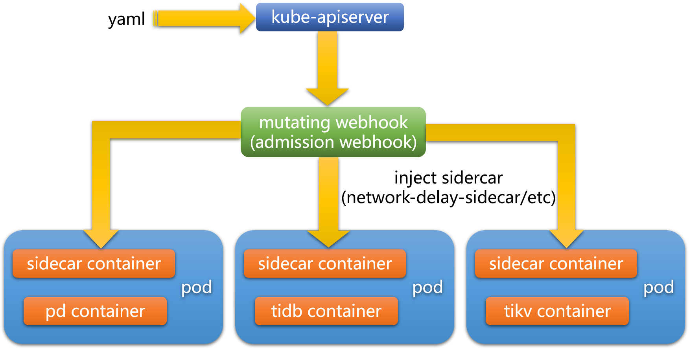
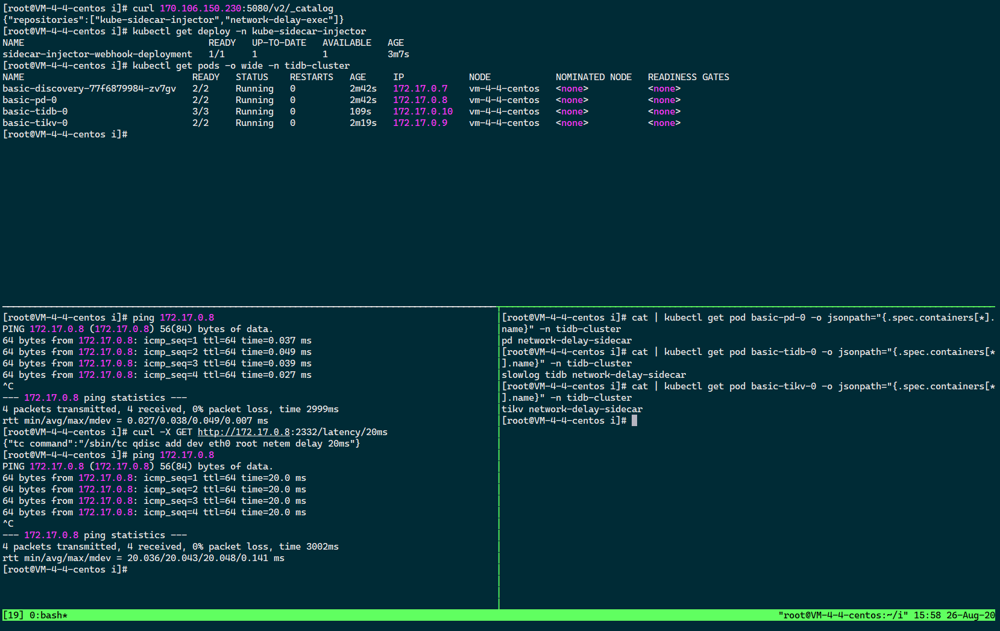

# Homework

<a name="YD38L"></a>
## 📑 目录
- [题目](#题目)
- [成果](#成果)
- [总结](#总结)
- [工作](#工作)
- [实验环境](#实验环境)
- [构建](#构建)
- [部署](#部署)
- [说明](#说明)
- [验证](#验证)
- [踩过的坑](#踩过的坑)
- [存在的问题](#存在的问题)
- [参考资料](#参考资料)
<a name="m4RrX"></a>
## 题目
> 实现在 Kubernetes 环境下，当创建 TiDB 集群时候给 TiDB 集群的每一个 Pod 动态注入一个 agent 容器， 这个 agent 容器中运行一个 agent 进程，并且这个 agent 支持设置网络延迟。
>

> Agent 使用方式
> curl -X GET  pod-ip:2332/latency/20ms
>

> Agent 延迟验证方式
> ping pod-ip
> PING 10.244.1.10 (10.244.1.10) 56(84) bytes of data.
> 64 bytes from 10.244.1.10: icmp_seq=1 ttl=62 time=20 ms
> 64 bytes from 10.244.1.10: icmp_seq=2 ttl=62 time=20 ms

<a name="MA8Id"></a>
## 成果
#### 项目
☑️[kube-sidecar-injector](https://github.com/neolay/kube-sidecar-injector)（用于注入 Sidecar 容器）

☑️[network-delay-exec](https://github.com/neolay/network-delay-exec)（用于设置网络延迟）
#### 视频展示
<a name="M3m67"></a>
#### ▶️[点击观看视频展示](https://www.yuque.com/docs/share/b468424a-8334-4b51-849c-6fc9a9876b8f)
<a name="MdByb"></a>
## 总结
我在收到小作业时，对 Kubernetes 中的概念几乎不了解，基本上就是听说过这个词的缩写叫 K8s 然后和是容器相关的东西。对容器的概念也就停留在用 Docker 命令部署和维护过几个自己的项目，甚至都没有写过 Dockerfile。<br />
<br />Kubernetes 光知道概念是永远不可能真正掌握的，需要亲自动手在机器上大量实验。好在小作业是给一周时间去完成，有充足的时间去了解、体验、练习。

站在完成的角度回顾整个过程，这次小作业在开发上难度不大，但是遇到的坑特别多。前期的重点是了解相关的概念和做实验，从写代码到调试成完实际上只花了周日到周二 3 天的时间。遗憾的是，很多问题没有及时记录，现在靠回忆写 README 有些细节可能记不到了。<br />
<br /> 过多的 Kubernetes 知识对这次小作业帮助似乎不是特别大，在了解到一定程度之后，我就及时去构思如何实现了。在正式开始之前，有几个点要非常明确，这是能完成本次小作业的前提，总结如下：

- **容器是对应用的包装，隔离 CPU 和内存等资源，是一种资源隔离抽象**
- **Pod 是对容器的包装，Pod 里面是容器，容器可以有多个，Pod 里的容器共享网络栈和存储资源**
- **Kubernetes 中的 Pod 具有逻辑上独立的网络和存储，是 Kubernetes 中的资源调度单位**


所以我能往 Kubernetes 环境下 TiDB 集群的 Pod 中注入 Sidecar 容器，Sidecar 容器里的进程能对 Pod 设置网络延迟，并且在设置网络延迟后只作用于这个 Pod，不会对其它 Pod 产生影响。

其它的一些 Kubernetes 基础概念如 Service、Development、ConfigMap、Secret、Namespace 等和 kubectl，在看了相关文档之后就可以上手写一些 demo 出来了。

当然这次小作业涉及的一个更重要的点就是 admission webhook 了。admission webhook 是用来接收准入请求的 HTTP 回调服务，当收到 Pod 创建请求，会动态修改待创建的 Pod 对象，例如注入 Sidecar 容器到 Pod 中。mutating webhook 是 admission webhook 的一种，它可以修改被其接受的对象，也是我这次用到的一种 admission webhook。关于 webhook 的身份验证、请求、响应、匹配规则等，Kubernetes 的这篇官方 [文档](https://kubernetes.io/zh/docs/reference/access-authn-authz/extensible-admission-controllers/#request) 给出了非常详细的说明。<br />
<br /><br />
<br />**工作原理如上图所示，整体工作流程如下**

- **用户通过 yaml 文件部署，在这个过程中会创建 mutating webhook，mutating webhook server 以 HTTP 服务的方式运行，处理由 apiserver 发送的 admissionReview 请求，mutating webhook server 通过 deployment 部署在 Kubernetes 集群中。**
- **工作过程中，mutating webhook 会拦截满足条件的请求并执行注入操作，Sidecar 容器由 mutating webhook 动态的注入到目标 Pod 中。**
- **设置网络延迟的程序支持 HTTP 调用，可以通过 RESTful API 传递 GET 请求的方式为目标容器设置网络延迟。**
<a name="DDU7M"></a>
## 工作

- 我用 Go 写了 2 个小项目 [kube-sidecar-injector](https://github.com/neolay/kube-sidecar-injector)（注入 Sidecar 容器）和 [network-delay-exec](https://github.com/neolay/network-delay-exec)（设置网络延迟）。
- 我几天前先是在 Katacoda 上玩了 chaosblade 对 Pod 进行混沌实验注入的网络延迟场景，知道了大致应该完成一个什么样的东西，然后再在自己的服务器上做 tc 实验，写出了能够设置网络延迟的 network-delay-exec，这其中遇到的主要是打镜像这个过程导致的后续相关问题。
- 在两天前 kube-sidecar-injector 还没完成时，我先临时用了阿里开源的 SidecarSet 给 Pod 注入 Sidecar，主要目的是为了验证我的 network-delay-exec 注入到 Kubernetes 的 Pod 之后是否达到预期的效果，避免同时调 2 个程序中错误不好定位，我在这个过程当中亲自体验了在一开始不太明白的 Kubernetes 中的一些概念，算是半个里程碑了。
- 在保证 network-delay-exec 能如预期工作之后，我着手开发 kube-sidecar-injector，我一开始想如 chaos-mesh 那样用 kubebuilder 来做，造一个类似于 SidecarSet 的东西出来，然而 kubebuilder 框架前后版本变化有点大，甚至找到的资料在介绍上都有冲突，调起 bug 来短时间内难以上手，受时间限制，最后决定使用 Kubernete  API 的原生方式来开发，在完成时重点参考了 morvencao 写的一篇介绍 mutating webhook 的 [blog](https://medium.com/ibm-cloud/diving-into-kubernetes-mutatingadmissionwebhook-6ef3c5695f74)，这篇博客给了我很大的启发。
<a name="E6uWX"></a>
## 实验环境

- **CPUs 2**
- **Memory 4GB**
- **Centos 7.6**
- **minikube v1.12.3**
- **Kubernetes v1.18.3**
- **Docker 19.03.12**
<a name="hcI48"></a>
## 构建
我使用的是 Docker 官方的 registry 镜像，启动本地仓库容器，启动之后执行 build 完成构建。
```bash
docker run -d -p 5080:5000 --name registry registry
chmod +x build
./build
```
<a name="KavO1"></a>
## 部署
**安装 Minikube 并启动 Kubernetes 集群**
> 参考 [安装 Minikube 并启动 Kubernetes 集群 | PingCAP Docs](https://docs.pingcap.com/zh/tidb-in-kubernetes/v1.0/deploy-tidb-from-kubernetes-minikube#%E5%AE%89%E8%A3%85-minikube-%E5%B9%B6%E5%90%AF%E5%8A%A8-kubernetes-%E9%9B%86%E7%BE%A4)

**为 kube-sidecar-injector 创建一个 namespace**
```bash
[root@VM-4-4-centos ~]# kubectl create ns kube-sidecar-injector
namespace/kube-sidecar-injector created
```
**为 webhook-create-signed-cert.sh 和 webhook-patch-ca-bundle.sh 增加可执行权限**
```bash
[root@VM-4-4-centos i]# chmod +x tidb_cluster_injection_example/webhook-create-signed-cert.sh
[root@VM-4-4-centos i]# chmod +x tidb_cluster_injection_example/webhook-patch-ca-bundle.sh
```
**创建证书和私钥，存储在 Secret 中，示例如下**
```bash
[root@VM-4-4-centos i]# ./tidb_cluster_injection_example/webhook-create-signed-cert.sh \
>     --service sidecar-injector-webhook-svc \
>     --secret sidecar-injector-webhook-certs \
>     --namespace kube-sidecar-injector
creating certs in tmpdir /tmp/tmp.vZznkjyDQR
Generating RSA private key, 2048 bit long modulus
........................+++
....................+++
e is 65537 (0x10001)
certificatesigningrequest.certificates.k8s.io/sidecar-injector-webhook-svc.kube-sidecar-injector created
NAME                                                 AGE   SIGNERNAME                     REQUESTOR       CONDITION
sidecar-injector-webhook-svc.kube-sidecar-injector   0s    kubernetes.io/legacy-unknown   minikube-user   Pending
certificatesigningrequest.certificates.k8s.io/sidecar-injector-webhook-svc.kube-sidecar-injector approved
secret/sidecar-injector-webhook-certs created
[root@VM-4-4-centos i]# cat tidb_cluster_injection_example/tidb-cluster-injection-example.yaml | \
>     tidb_cluster_injection_example/webhook-patch-ca-bundle.sh > \
>     tidb_cluster_injection_example/tidb-cluster-injection-example-ca-bundle.yaml
```
**部署，执行**`kubectl create -f tidb_cluster_injection_example/tidb-cluster-injection-example-ca-bundle.yaml`，**示例如下**
```bash
[root@VM-4-4-centos i]# kubectl create -f tidb_cluster_injection_example/tidb-cluster-injection-example-ca-bundle.yaml
configmap/sidecar-injector-webhook-configmap created
deployment.apps/sidecar-injector-webhook-deployment created
service/sidecar-injector-webhook-svc created
mutatingwebhookconfiguration.admissionregistration.k8s.io/sidecar-injector-webhook-cfg created
```
- 在 tidb-cluster-injection-example-ca-bundle.yaml 文件中，sidecar-injector-webhook-configmap 定义了 network-delay-sidecar 容器相关的配置，当然也可以替换成其他容器，不过要注意修改配置和权限
```yaml
apiVersion: v1
kind: ConfigMap
metadata:
  name: sidecar-injector-webhook-configmap
  namespace: kube-sidecar-injector
data:
  sidecarconfig.yaml: |
    containers:
      - name: network-delay-sidecar
        image: 127.0.0.1:5080/network-delay-exec:v1
        imagePullPolicy: Always
        ports:
          - name: sidecar-server
            containerPort: 2332
        securityContext:
          capabilities:
            add:
              - NET_ADMIN
```
- 在 tidb-cluster-injection-example-ca-bundle.yaml 文件中，sidecar-injector-webhook-cfg 通过 sidecar-injector-webhook-svc.sidecar-injector/mutate 提供 mutating webhook，匹配 rules 中定义的 operations、apiGroups、apiVersions、resources 规则
```yaml
apiVersion: v1
kind: Service
metadata:
  name: sidecar-injector-webhook-svc
  namespace: kube-sidecar-injector
  labels:
    app: sidecar-injector
spec:
  ports:
    - port: 443
      targetPort: 8443
  selector:
    app: sidecar-injector
---
apiVersion: admissionregistration.k8s.io/v1beta1
kind: MutatingWebhookConfiguration
metadata:
  name: sidecar-injector-webhook-cfg
  labels:
    app: sidecar-injector
webhooks:
  - name: sidecar-injector.mutating.webhook
    clientConfig:
      service:
        name: sidecar-injector-webhook-svc
        namespace: kube-sidecar-injector
        path: "/mutate"
      caBundle: ${CA_BUNDLE}
    rules:
      - operations: ["CREATE", "UPDATE"]
        apiGroups: ["apps", ""]
        apiVersions: ["v1"]
        resources: ["pods"]
    namespaceSelector:
      matchLabels:
        sidecar-injection: enabled
```
- 在 tidb-cluster-injection-example-ca-bundle.yaml 文件中，sidecar-injector-webhook-deployment 完成最终部署
```yaml
apiVersion: apps/v1
kind: Deployment
metadata:
  name: sidecar-injector-webhook-deployment
  namespace: kube-sidecar-injector
  labels:
    app: sidecar-injector
spec:
  replicas: 1
  selector:
    matchLabels:
      app: sidecar-injector
  template:
    metadata:
      labels:
        app: sidecar-injector
    spec:
      containers:
        - name: sidecar-injector
          image: 127.0.0.1:5080/kube-sidecar-injector:v2
          imagePullPolicy: IfNotPresent
          args:
            - -sidecarCfgFile=/etc/webhook/config/sidecarconfig.yaml
            - -tlsCertFile=/etc/webhook/certs/cert.pem
            - -tlsKeyFile=/etc/webhook/certs/key.pem
            - -alsologtostderr
            - -v=4
            - 2>&1
          volumeMounts:
            - name: webhook-certs
              mountPath: /etc/webhook/certs
              readOnly: true
            - name: webhook-config
              mountPath: /etc/webhook/config
      volumes:
        - name: webhook-certs
          secret:
            secretName: sidecar-injector-webhook-certs
        - name: webhook-config
          configMap:
            name: sidecar-injector-webhook-configmap
```
**安装 TiDB Operator 并运行 TiDB 集群**
> 参考 [安装 TiDB Operator 并运行 TiDB 集群 | PingCAP Docs](https://docs.pingcap.com/zh/tidb-in-kubernetes/v1.0/deploy-tidb-from-kubernetes-minikube#%E5%AE%89%E8%A3%85-tidb-operator-%E5%B9%B6%E8%BF%90%E8%A1%8C-tidb-%E9%9B%86%E7%BE%A4)

<a name="MBW2c"></a>
## 说明
**设置网络延迟，延迟时间 time 是必要参数，单位是毫秒**
```bash
curl -X GET http://pod-ip:2332/latency/:time
```
<a name="f7lsG"></a>
## 验证
<br /> 截图中上方列出了 tidb-cluster 中的所有 Pod 的 IP，验证部分的输出如下：
```bash
[root@VM-4-4-centos i]# kubectl get deploy -n kube-sidecar-injector
NAME                                  READY   UP-TO-DATE   AVAILABLE   AGE
sidecar-injector-webhook-deployment   1/1     1            1           3m7s
[root@VM-4-4-centos i]# kubectl get pods -o wide -n tidb-cluster
NAME                               READY   STATUS    RESTARTS   AGE     IP            NODE            NOMINATED NODE   READINESS GATES
basic-discovery-77f6879984-zv7gv   2/2     Running   0          2m42s   172.17.0.7    vm-4-4-centos   <none>           <none>
basic-pd-0                         2/2     Running   0          2m42s   172.17.0.8    vm-4-4-centos   <none>           <none>
basic-tidb-0                       3/3     Running   0          109s    172.17.0.10   vm-4-4-centos   <none>           <none>
basic-tikv-0                       2/2     Running   0          2m19s   172.17.0.9    vm-4-4-centos   <none>           <none>
```
截图中右下方列出了 Pod 中的所有容器，可以看到 tidb-cluster 中的所有 Pod 在创建时都已经注入了 network-delay-sidecar 容器，结果符合预期，验证部分的输出如下：
```bash
[root@VM-4-4-centos i]# cat | kubectl get pod basic-pd-0 -o jsonpath="{.spec.containers[*].name}" -n tidb-cluster
pd network-delay-sidecar
[root@VM-4-4-centos i]# cat | kubectl get pod basic-tidb-0 -o jsonpath="{.spec.containers[*].name}" -n tidb-cluster
slowlog tidb network-delay-sidecar
[root@VM-4-4-centos i]# cat | kubectl get pod basic-tikv-0 -o jsonpath="{.spec.containers[*].name}" -n tidb-cluster
tikv network-delay-sidecar
```
截图中左下方展示了先在不加网络延迟的状态下 ping 一个 Pod 的 IP，然后通过 **`curl -X GET `**[**`http://172.17.0.8:2332/latency/20ms`**](http://172.17.0.8:2332/latency/20ms) 设置 20ms 网络延迟，再在设置了 20ms 网络延迟的状态下 ping 这个 Pod 的 IP。可以看到，第 1 次 ping 的延迟在 0.3ms 左右，第 2 次 ping 的延迟在 20ms 左右，结果符合预期，验证部分的输出如下：
```bash
[root@VM-4-4-centos i]# ping 172.17.0.8
PING 172.17.0.8 (172.17.0.8) 56(84) bytes of data.
64 bytes from 172.17.0.8: icmp_seq=1 ttl=64 time=0.037 ms
64 bytes from 172.17.0.8: icmp_seq=2 ttl=64 time=0.049 ms
64 bytes from 172.17.0.8: icmp_seq=3 ttl=64 time=0.039 ms
64 bytes from 172.17.0.8: icmp_seq=4 ttl=64 time=0.027 ms
^C
--- 172.17.0.8 ping statistics ---
4 packets transmitted, 4 received, 0% packet loss, time 2999ms
rtt min/avg/max/mdev = 0.027/0.038/0.049/0.007 ms
[root@VM-4-4-centos i]# curl -X GET http://172.17.0.8:2332/latency/20ms
{"tc command":"/sbin/tc qdisc add dev eth0 root netem delay 20ms"}
[root@VM-4-4-centos i]# ping 172.17.0.8
PING 172.17.0.8 (172.17.0.8) 56(84) bytes of data.
64 bytes from 172.17.0.8: icmp_seq=1 ttl=64 time=20.0 ms
64 bytes from 172.17.0.8: icmp_seq=2 ttl=64 time=20.0 ms
64 bytes from 172.17.0.8: icmp_seq=3 ttl=64 time=20.0 ms
64 bytes from 172.17.0.8: icmp_seq=4 ttl=64 time=20.0 ms
^C
--- 172.17.0.8 ping statistics ---
4 packets transmitted, 4 received, 0% packet loss, time 3002ms
rtt min/avg/max/mdev = 20.036/20.043/20.048/0.141 ms
```
<a name="kbcba"></a>
## 踩过的坑

- 本地虚拟机部署 Kubernetes 不太方便操作 => 买了一个学生服务器
- 学生服务器配置不够部署 Kubernetes=> 换成了一个 2 核 4G 服务器
- 大陆服务器的网络环境对 Kubernetes、Docker、Go 和 GitHub 都不友好也不想在服务器上配各种代理和换镜像仓库 => 换成了一个腾讯云硅谷地区的 2 核 4G 服务器，吹爆这丝滑的体验
- 不知道给 Pod 设置网络延迟是什么感觉 => 在 Katacoda 上玩 chaosblade 找到了感觉
- 容器启动失败 => 查日志找原因
- 还没有写注入容器的代码不太好真实的测试设置网络延迟的代码 => 先临时用 SidecarSet 注入容器
- tc 不存在 => 查日志，进容器内部一顿测试，发现是镜像的问题，最后换成了有 tc 的镜像
- tc 没权限 => 查资料，给容器加上网络权限
- 容器没暴露端口在外部拒绝访问 => 查资料，在部署时暴露端口
- Go 执行 tc 命令设置参数格式有错误 => 查参数的设置方式，修复
- yaml 部署文件里的各种配置错误（经常出现）=> 查各种资料，或者全局搜索关键字参考 chaos-mesh 等项目里的使用方式
- helm2 和 helm3 不兼容
- 在尝试 kubebuilder 时遇到的一堆坑，一言难尽
- ······

以上是我在开发过程中经常出现或印象比较深刻的坑，在练习时踩过的坑回忆不到细节了
<a name="UIfze"></a>
## 存在的问题

- 目前只能支持设置网络延迟的场景，由于 tc 修改了容器的网络，再重复执行 tc 设置网络延迟指令就会报错。在开发的时候有想过加入修改和删除网络延迟的功能，其实简单的实现只要为对应的 tc 指令加上路由规则就可以了。但鉴于这次考察的重点是如何动态注入容器，不是 Web 服务，就只保留了题目中要求的设置网络延迟的功能。
- 使用 tc，再配合 iptables，可以支持更多的网络故障场景，后面有时间还需深入研究。
- 虽然只玩了 SidecarSet 最基础的注入功能，但觉得 SidecarSet 是一个比较创新的设计，限于时间没有去了解更多。
- 通过几天的时间了解并上手 Kubernetes，接触了很多新东西，Cloud Native 也使我大开眼界。我度过了充实的几天，对这个新领域也少了几分陌生，多了几分感情。
<a name="VYY2q"></a>
## 参考资料

- [Kubernetes 上使用 TiDB Operator 快速上手 | PingCAP Docs](https://docs.pingcap.com/zh/tidb-in-kubernetes/stable/get-started)
- [chaosblade 和 chaos-mesh 作为生产测试标准，哪个更适合 2020 年的团队云原生技术规划？ - 知乎](https://www.zhihu.com/question/364324836)
- [Pod 实验场景 | guoxudong | Katacoda](https://katacoda.com/guoxudong/scenarios/chaosblade-pod-experiment)
- [networking:netem [Wiki]](https://wiki.linuxfoundation.org/networking/netem)
- [kruise/sidecarset.md at master · openkruise/kruise](https://github.com/openkruise/kruise/blob/master/docs/tutorial/sidecarset.md)
- [使用准入控制器 | Kubernetes](https://kubernetes.io/zh/docs/reference/access-authn-authz/admission-controllers/)
- [动态准入控制 | Kubernetes](https://kubernetes.io/zh/docs/reference/access-authn-authz/extensible-admission-controllers/)
- [Introduction · Kubebuilder 使用指南](https://blog.upweto.top/gitbooks/kubebuilder/)
- [Diving into Kubernetes MutatingAdmissionWebhook | by Morven Cao | IBM Cloud | Medium](https://medium.com/ibm-cloud/diving-into-kubernetes-mutatingadmissionwebhook-6ef3c5695f74)


